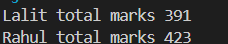
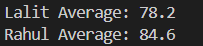
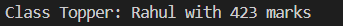
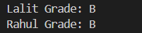

## Console Outputs Screenshots

### 1. Calculation of Total Marks

This function calculate the total marks of student iterate the marks array and then it loops through a list of student for each student it prints name with total marks by calling function.

---

### 2. Calculation of Average Marks

This function calculate the average marks of student. it reuse the total marks function to avoid code duplication then divide the total by the number of subject, then iterate the each student and print name , average marks

---

### 3. Subject-wise Highest Score

find highest score for each subject by iterating through all student and their marks.It uses an object as a hash map where each subject is a key.for each subject, it compares scores and updates the stored value if a higher score is found. finally, it prints the top scorer for each subject.

---

### 4. Subject-wise Averages

This function calculates subject-wise averages by iterating through all students and their marks. it uses an object to group data by subject, storing total scores and count. after processing all data, it computes the average for each subject and prints it.

---

### 5. Class Topper

This function finds the class topper by iterating through all students and calculating their total marks using a helper function. it keeps track of the maximum marks and updates the topper whenever a higher score is found. finally, it returns the topper name and marks.

---

### 6. Grades Logic

This function determines a student grade based on multiple conditions. it first checks if the student has failed in any subject or low attendance returning early if so. If the student passes these conditions, it calculates the average marks and assigns a grade based on predefined value.

---
