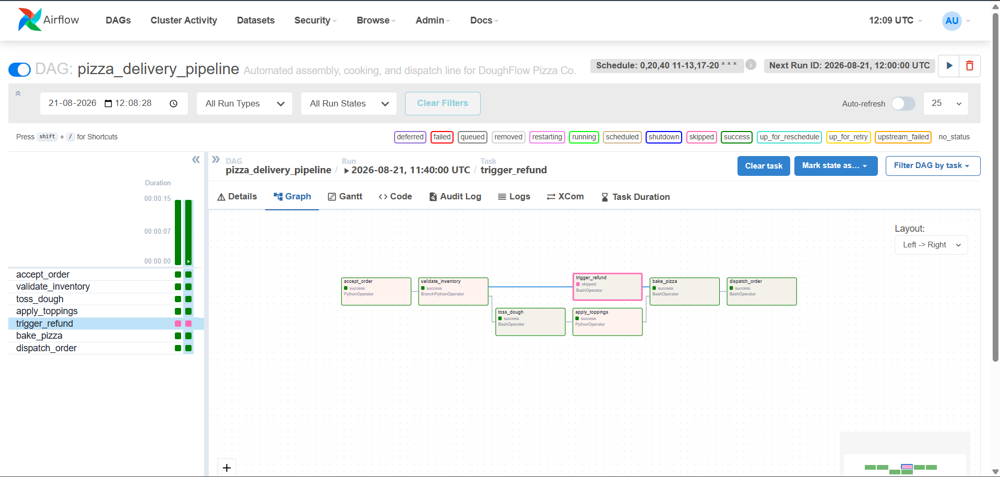
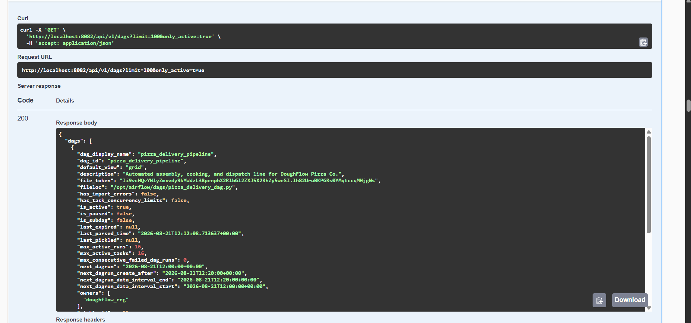
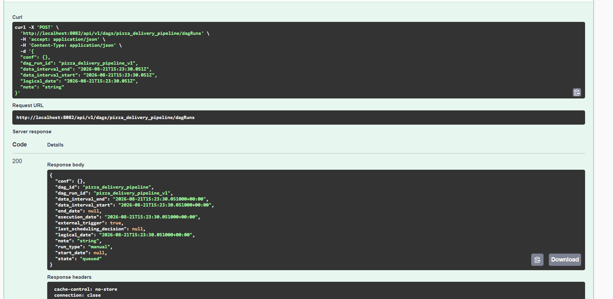
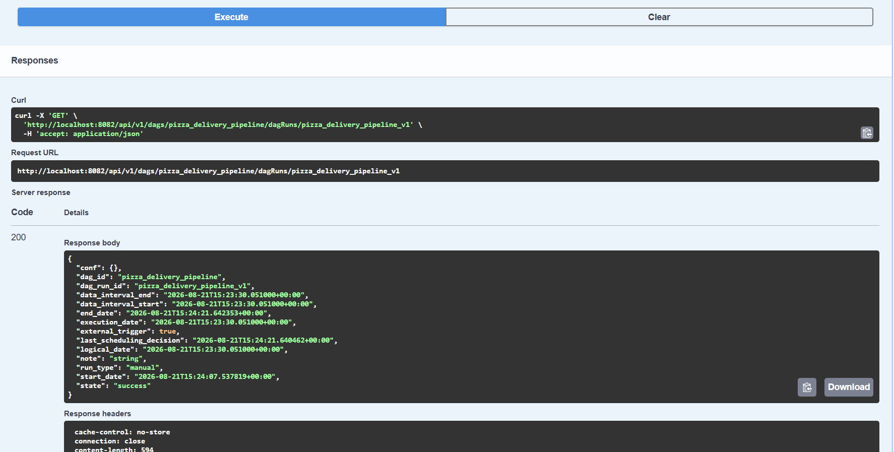
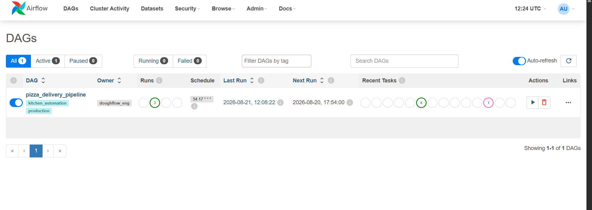
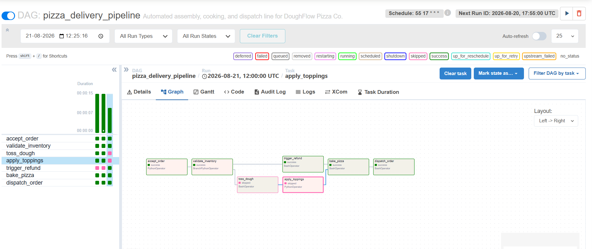

#  DoughFlow Pizza Kitchen Pipeline
An automated Apache Airflow DAG managing an end-to-end pizza assembly, cooking, and dispatch line.

##  Task Flow & Workflow
1. **`accept_order`**: Generates and broadcasts a unique order ID and topping list.
2. **`validate_inventory`**: Checks stock. 85% chance to proceed to prep; 15% chance to skip to refund.
3. **`toss_dough` & `apply_toppings`**: Simulates mechanical preparation using automated shell commands.
4. **`trigger_refund`**: Executes a simulated Stripe API payment reversal if stock checks fail.
5. **`bake_pizza`**: Convergent oven step. Executes safely even when previous tasks are skipped.
6. **`dispatch_order`**: Launches autonomous drone delivery routing matrix.

## Key Airflow Concepts
* **XCom Data Sharing:** Dynamically pushes and pulls `order_id` and `topping_list` arrays between isolated tasks.
* **BranchPythonOperator:** Evaluates runtime logic to dynamically choose the prep path or the refund path.
* **`none_failed_min_one_success` Trigger Rule:** Prevents pipeline errors at the `bake_pizza` step when upstream tasks are systematically skipped.

## Quick Start
1. Drop the pipeline script into your Airflow `dags/` folder.
2. Unpause **`pizza_delivery_pipeline`** in the Airflow UI.
3. Click **Trigger DAG** to watch the conditional branching execute in real-time.
4. Check the **Task Logs** to see the custom `[ASSEMBLY]` and `[ORDER RECEIPT]` logs.

If you want to adjust the DAG execution schedule or expand the XCom data models, let me know how you would like to customize it!

#### images

